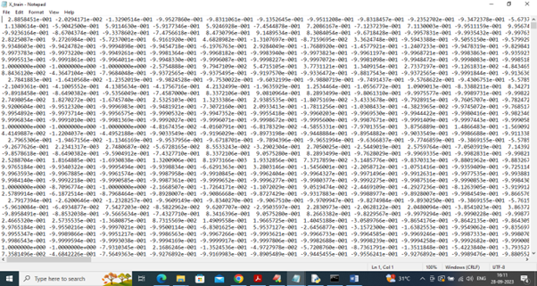
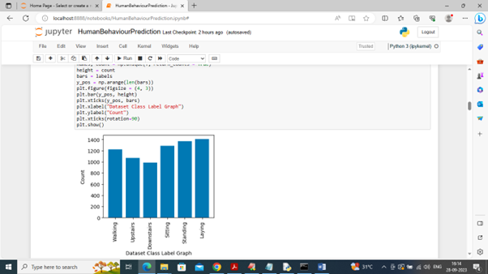
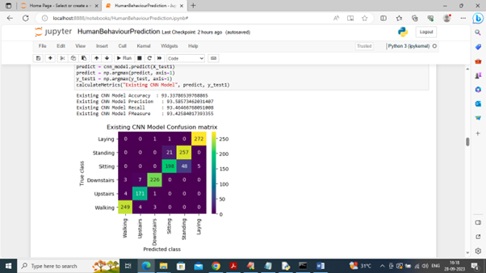
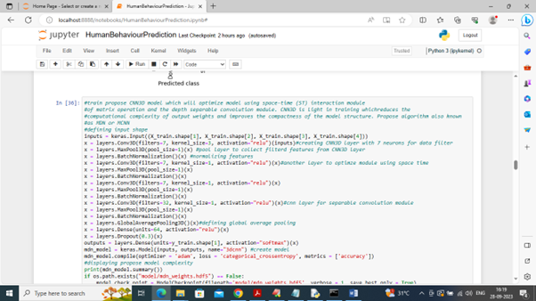
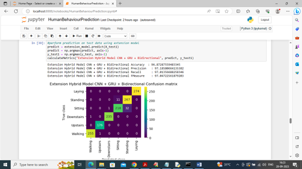
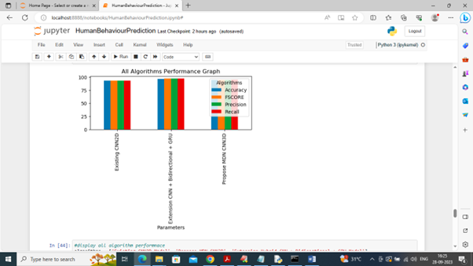
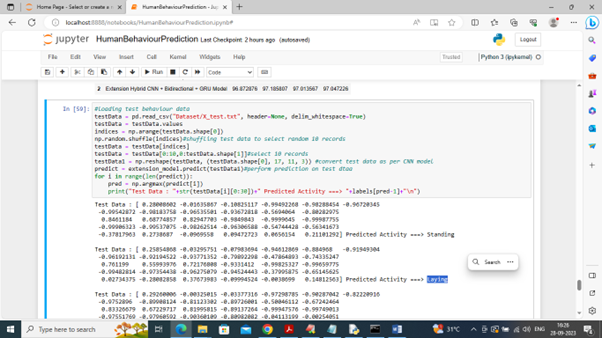

# 🧠 Human Behaviour Recognition using Multiscale CNN

## 📌 Overview

This project focuses on recognizing human activities using a Multiscale Convolutional Neural Network (CNN). It integrates deep learning with a Django-based web interface to provide an end-to-end solution.

---

## 🚀 Features

* Multiscale CNN for feature extraction
* Accurate human activity classification
* Web interface using Django
* Scalable ML pipeline

---

## 🛠️ Tech Stack

* Python
* TensorFlow / Keras
* Django
* NumPy, Pandas

---

## 📂 Project Structure

* `HumanBehaviour/` → Main application
* `model/` → ML models
* `DatasetLink.txt` → Dataset reference

---

## ▶️ How to Run

```bash
pip install -r requirements.txt
python manage.py runserver
```

---

## 📊 Output

Predicts human activities such as walking, sitting, and standing.

---

## 📌 Note

Dataset is not included due to size limitations. Refer to `DatasetLink.txt`.

---

## 📸 Screenshots

### 📊 Dataset Visualization



### 📈 Activity Distribution



### 🤖 CNN2D Model Output



### 🧠 MCNN (CNN3D) Model Output



### 🚀 Extension Model (CNN + GRU + Bi)



### 📊 Model Comparison



### 🔍 Prediction Output



---

## 👨‍💻 Author

Purushotham
